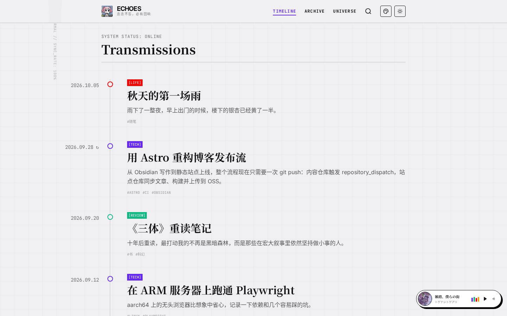
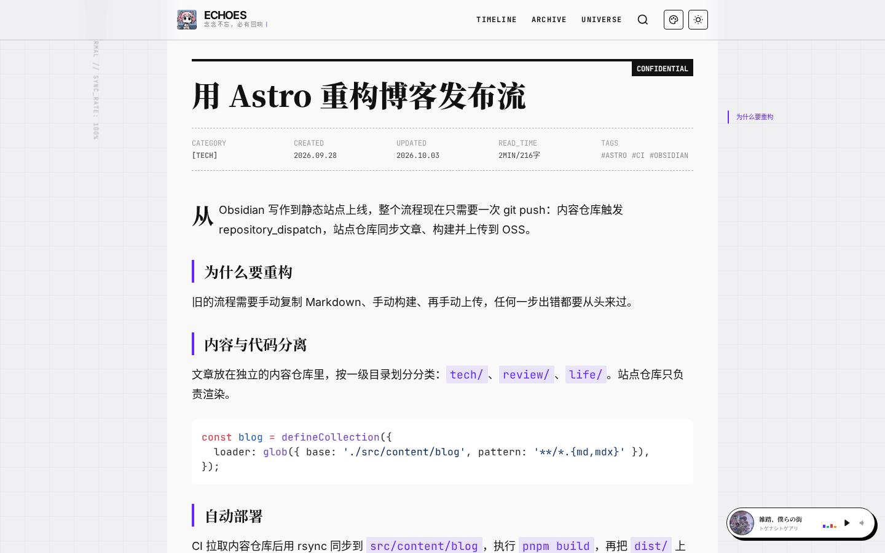
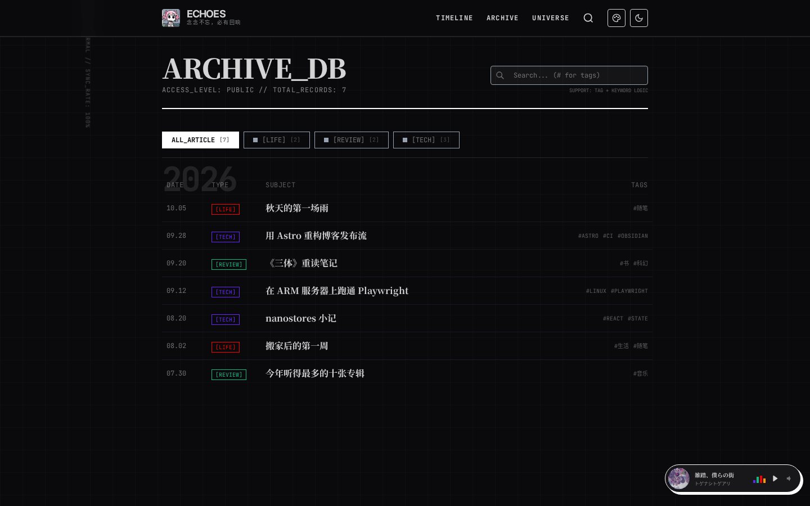
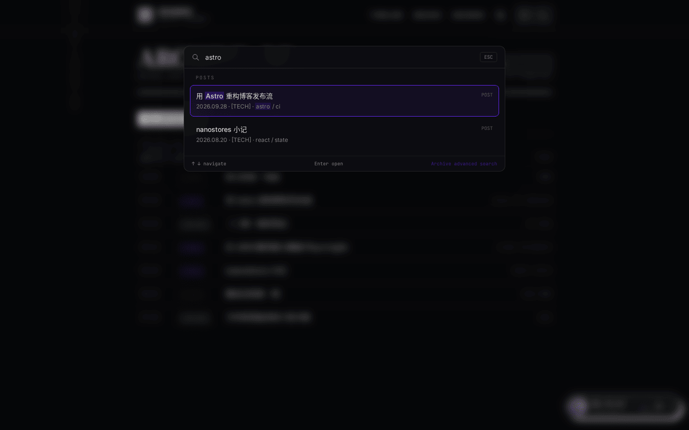
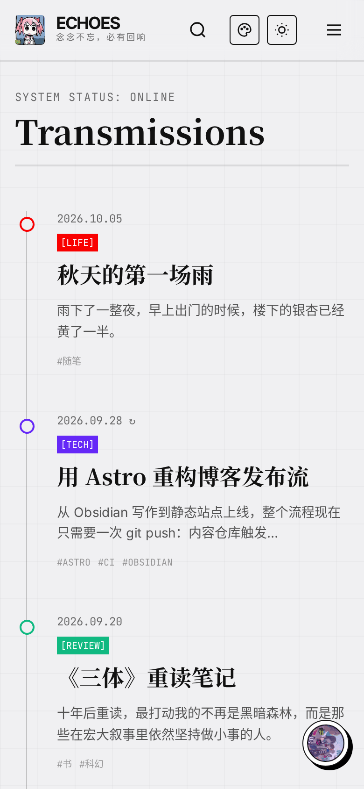

# Echoes

> 念念不忘，必有回响

Echoes 是 [sounfury](https://github.com/sounfury) 的个人博客 [blog.sounfury.top](https://blog.sounfury.top)，基于 Astro 构建的静态站点。文章用 Obsidian 写在独立的内容仓库里，推送后由 GitHub Actions 同步内容、构建并发布到阿里云 OSS。

## 截图

| 时间轴（默认主题） | 文章页 |
| --- | --- |
|  |  |
| **归档（暗色模式）** | **快速搜索（Ctrl / ⌘ + K）** |
|  |  |

<table>
  <tr>
    <th>「爆裂魔导 · 惠惠」主题</th>
    <th>移动端</th>
  </tr>
  <tr>
    <td></td>
    <td width="240"></td>
  </tr>
</table>

> 截图使用的是演示文章，不是线上真实内容。

## 功能

- **时间轴首页**：按创建时间倒序展示文章，滚动自动加载，每页条数可配置；文章更新过会在日期旁标记 ↻；支持封面图悬停展示。
- **归档页**：按年份分组，可按分类筛选，搜索框支持关键词和 `#标签` 组合过滤，筛选状态同步到 URL，方便分享。
- **快速搜索**：`Ctrl / ⌘ + K` 唤起命令面板，按标题、标签检索文章，支持拼音匹配和键盘导航。
- **文章页**：档案风格的元信息（分类、创建 / 更新时间、阅读时长、字数、标签），自动生成目录并高亮当前章节，兼容 Obsidian Callouts，代码高亮跟随明暗模式。
- **评论**：文章底部接入 [Waline](https://waline.js.org/) 评论，游客填写昵称和邮箱即可留言。
- **全局音乐播放器**：基于 Meting 接口播放网易云歌单，换页不中断，支持歌词、音量调节和自由拖拽；单篇文章可在 frontmatter 里指定配乐。
- **主题系统**：内置「极简主义」（亮 / 暗）和「爆裂魔导 · 惠惠」两套主题，读者可在页头切换。主题只依赖 `src/themes/_contract.md` 中约定的接口，构建时会自动校验。
- **其他**：SEO 元信息、sitemap、robots.txt、自定义 404 页面、页脚备案号。

## 技术栈

- [Astro 5](https://astro.build/)（静态输出）+ MDX
- React 19（归档页、搜索、播放器等交互组件）+ [nanostores](https://github.com/nanostores/nanostores)
- Tailwind CSS 4 + Sass
- Shiki 代码高亮、Waline 评论、pinyin-pro 拼音搜索
- 部署：GitHub Actions → 阿里云 OSS，Bark 推送部署通知

## 快速开始

需要 Node.js 20+ 和 pnpm 9。

```bash
pnpm install --frozen-lockfile
pnpm dev        # 启动开发服务器（监听所有网卡）
pnpm build      # 生成媒体索引并构建到 dist/
pnpm preview    # 本地预览构建结果
pnpm astro check
```

文章内容不在本仓库里（`src/content/` 已被 `.gitignore` 忽略）。本地开发时，把 Markdown 文件放到 `src/content/blog/<分类>/` 下即可，例如：

```
src/content/blog/
├── tech/用 Astro 重构博客发布流.md
├── review/《三体》重读笔记.md
└── life/秋天的第一场雨.md
```

`pnpm dev` 下还可以访问 `/dev/themes`，在同一页查看各个界面组件在不同主题、不同状态下的样子（生产构建不包含此页）。

## 写作

- **一级目录就是分类**（如 `tech`、`review`、`life`），更深的目录只用于整理，不影响分类和链接；文章标题直接取文件名。
- 文章地址为 `/posts/<分类>/<文件名>`。
- 分类的显示名称、颜色和说明在 `src/config/site.config.yaml` 的 `category` 中配置，未配置的分类使用默认颜色。

frontmatter 字段（定义见 `src/content.config.ts`）：

```yaml
---
创建时间: 2026-09-28            # 时间轴排序依据
更新时间: 2026-10-03            # 与创建时间不同时显示「已更新」
published: true                 # 必须显式为 true 才会发布
tags: [astro, ci]
封面图: https://example.com/cover.jpg               # 可选
music: https://music.163.com/song?id=xxxx           # 可选，网易云单曲链接，作为本文配乐
mediaRefs: [https://neodb.social/book/xxxx]         # 可选，关联的 NeoDB 条目
---
```

`pnpm build` 会先运行 `scripts/build-media-links.mjs`，根据 `mediaRefs` 生成 `public/data/media-links.json`（NeoDB 条目 → 文章的索引）。

## 配置

站点配置集中在 `src/config/site.config.yaml`，启动时会用 zod 校验：

| 配置项 | 说明 |
| --- | --- |
| `site` | 标题、副标题、描述、站点地址、作者、Logo 文字、时区、备案号 |
| `theme` | 默认主题、默认明暗模式、默认主题配色 |
| `navigation` | 导航链接，支持外链 |
| `timeline.pageSize` | 时间轴每次加载的条数 |
| `category` | 分类标签、颜色、说明 |
| `bgm` | 全局播放器开关、Meting 接口地址、默认歌单 |
| `comment` | Waline 评论服务地址与表单选项 |
| `ops.bark` | 部署通知的开关、图标和消息模板 |

### 主题

主题放在 `src/themes/<id>/`，由 `theme.json`（名称、支持的明暗模式、可替换的文案等）和 `theme.css` 组成，可选 `effects.ts` 提供动效。开发主题前请先读 [`src/themes/_contract.md`](src/themes/_contract.md)；惠惠主题的说明见 [`src/themes/megumin/README.md`](src/themes/megumin/README.md)。

## 部署

部署由 [`.github/workflows/deploy-oss.yml`](.github/workflows/deploy-oss.yml) 完成，以下情况会触发：

- 向 `dev` 或 `master` 推送（只改 `spec/` 或 Markdown 文件时跳过）；
- 内容仓库 `sounfury/blog` 通过 `repository_dispatch`（`content_changed`）通知；
- 手动运行 workflow。

流程：拉取内容仓库 → 把含 Markdown 的一级目录同步到 `src/content/blog` → `pnpm build` → 上传 `dist/` 到 OSS → 用 `scripts/notify.py` 发送 Bark 通知（单篇新文章、批量更新、仅代码部署、部署失败各有一套模板）。

需要的仓库 Secrets：

| Secret | 用途 |
| --- | --- |
| `CROSS_REPO_TOKEN` | 读取私有内容仓库 |
| `OSS_ACCESS_KEY_ID` / `OSS_ACCESS_KEY_SECRET` / `OSS_BUCKET` / `OSS_ENDPOINT` | 上传到阿里云 OSS |
| `BARK_KEY` | Bark 推送 |

## 目录结构

```
.
├── .github/workflows/   # 部署 workflow
├── integrations/        # Astro 集成：主题接口校验、/dev/themes 调试页
├── public/              # 静态资源
├── scripts/             # 构建与 CI 脚本（媒体索引、Bark 通知）
├── spec/                # 需求文档与待办
└── src/
    ├── components/      # 按页面划分的组件（home / archive / post / search / player / common）
    ├── config/          # site.config.yaml
    ├── layouts/         # 基础布局与文章布局
    ├── lib/             # 配置读取、工具函数、主题运行时、客户端脚本
    ├── pages/           # 路由：首页、归档、文章、404
    ├── stores/          # nanostores 状态（主题、播放器）
    ├── styles/          # 全局样式与文章排版
    └── themes/          # 主题包与接口约定
```
